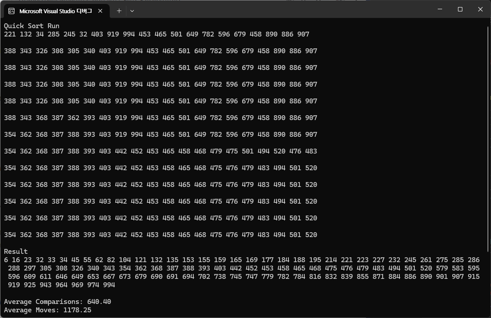

# Quick Sort {Result Image}

# 정렬 알고리즘의 비교
1. 선택 정렬 (Selection Sort)
설명: 주어진 배열에서 가장 작은 요소를 찾아서 첫 번째 위치와 교환하고, 두 번째 위치에서 가장 작은 요소를 찾아서 교환하는 방식으로 진행
시간 복잡도: O(n^2) (최악, 평균, 최선)
특징: 단순하지만 비효율적이며, 안정적이지 않다.

2. 삽입 정렬 (Insertion Sort)
설명: 배열을 부분적으로 정렬된 상태로 유지하며, 새로운 요소를 적절한 위치에 삽입하는 방식
시간 복잡도: O(n^2) (최악, 평균), O(n) (이미 정렬된 경우)
특징: 소규모 데이터나 거의 정렬된 데이터에 효과적이며, 안정적이다.

3. 버블 정렬 (Bubble Sort)
설명: 인접한 요소를 비교하여 정렬하는 방식으로, 가장 큰 요소가 배열의 끝으로 버블처럼 이동
시간 복잡도: O(n^2) (최악, 평균), O(n) (최선, 이미 정렬된 경우)
특징: 이해하기 쉽지만 비효율적이며, 안정적이다.

4. 쉘 정렬 (Shell Sort)
설명: 삽입 정렬의 일반화로, 간격을 두고 요소를 비교하여 정렬한 후, 간격을 줄여가며 정렬
시간 복잡도: O(nlogn) ~ O(n^3/2) (간격에 따라 다름)
특징: 삽입 정렬보다 빠르며, 대부분의 경우 효율적이다.

5. 합병 정렬 (Merge Sort)
설명: 배열을 반으로 나누어 각각 정렬한 후, 다시 병합하여 정렬
시간 복잡도: O(nlogn) (최악, 평균, 최선)
특징: 안정적이고 큰 데이터 세트에 효율적이며, 외부 정렬에 적합하다.

6. 퀵 정렬 (Quick Sort)
설명: 피벗을 선택하여 피벗보다 작은 요소와 큰 요소로 분할한 후, 재귀적으로 정렬
시간 복잡도: O(n^2) (최악, 피벗 선택이 불량한 경우), O(nlogn) (평균, 최선)
특징: 일반적으로 빠르며, 안정적이지 않다.

성능 비교

단순 정렬: 선택, 삽입, 버블 정렬은 O(n^2)의 성능을 가지며, 대량의 데이터에는 비효율적

효율적인 정렬: 쉘, 합병, 퀵 정렬은 O(nlogn)의 성능을 가지며, 대량의 데이터에 적합

안정성: 삽입, 버블, 합병 정렬은 안정적이지만, 선택, 쉘, 퀵 정렬은 비안정적

모두 제자리 정렬이 가능

결론적으로, 데이터의 크기와 특성에 따라 적절한 정렬 알고리즘을 선택하는 것이 중요
